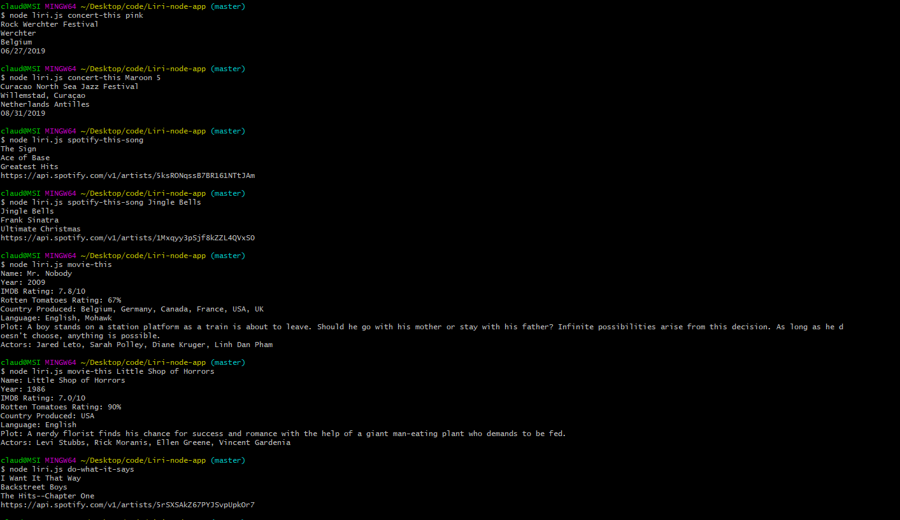

# Liri-node-app

The purpose of this file is to explore the node.js capabilities. In the following recording you will see that I used node.js to create a 'liri' which, upon given instructions i.e when you ask liri to 'concert-this', 'spotify-this-song', 'do-what-it-says' or 'movie-this'. It can differentiate between the four commands to pull from back-end api calls to retrieve information on the given subject. For both spotify-this-song and movie-this if the user does not fill in a command it will auto-generate commands I have prompted.

